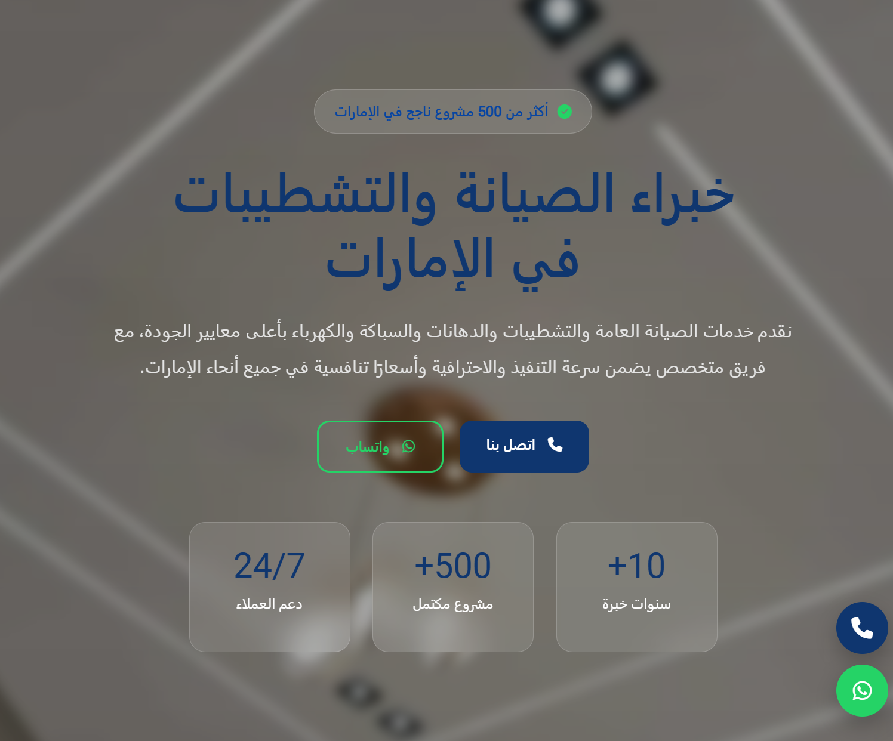
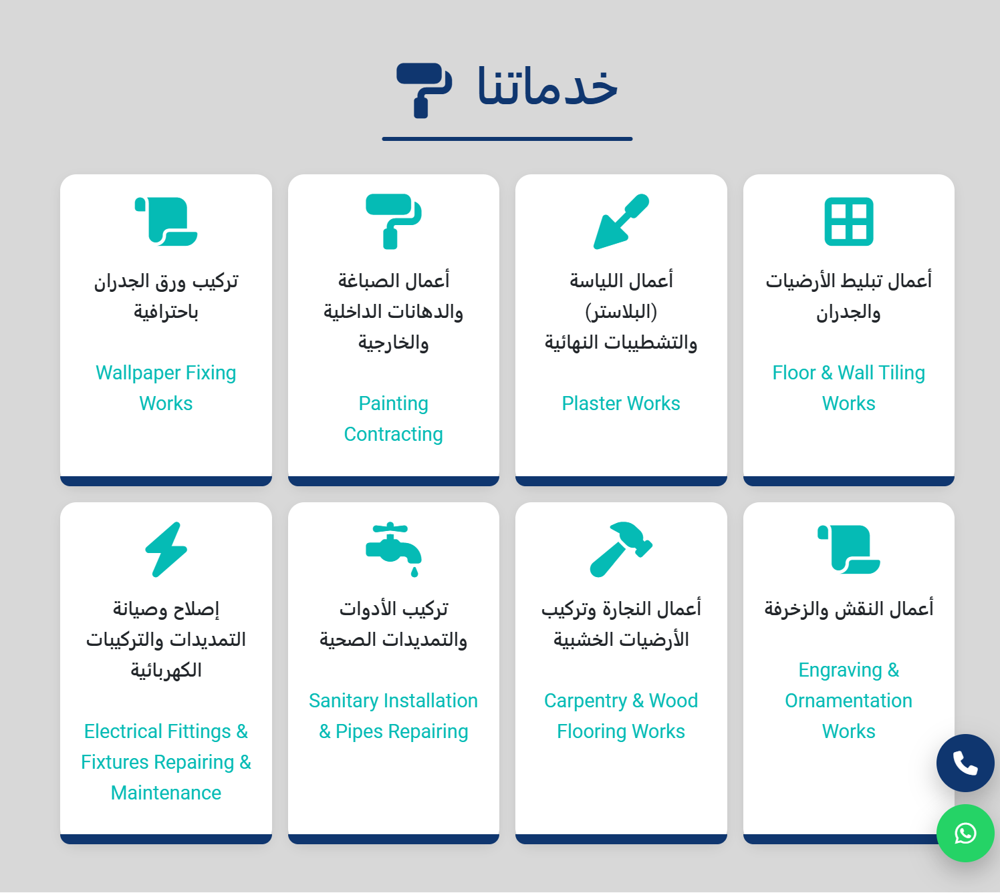
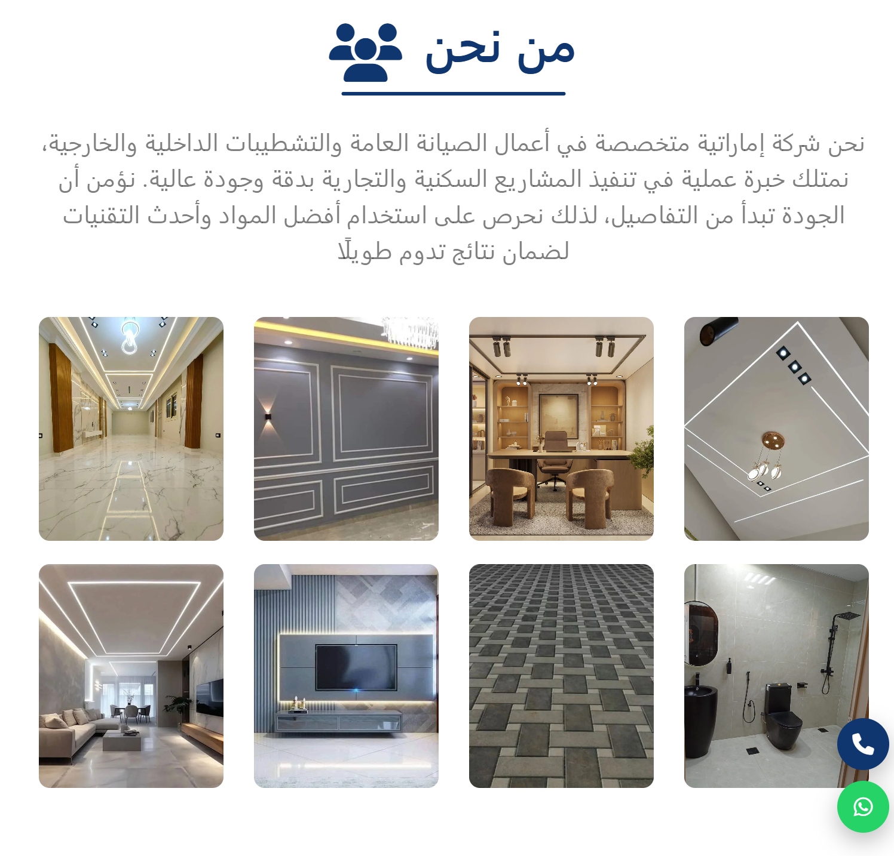

# 🏢 Ghada Afdal Company

A modern, responsive website for **Ghada Afdal General Maintenance & Finishing Company** in the UAE.

The website showcases the company's services, experience, contact information, and provides a professional online presence with a focus on performance, SEO, and user experience.

---

## 🌐 Live Demo

🔗 https://ghada-afdal.netlify.app/

---

## 📸 Preview

> Add screenshots here.

### Home Page



### Services



### About



### Contact


---

# ✨ Features

- Modern and clean UI
- Fully Responsive Design
- Mobile First
- RTL Arabic Support
- Smooth Scrolling Navigation
- Animated Sections (AOS)
- Interactive Timeline
- Professional Footer
- Floating Contact Buttons
- WhatsApp Integration
- Click to Call
- Google Maps Integration
- SEO Optimized
- Accessibility Improvements
- Fast Loading
- Cross Browser Compatible

---

# 🛠 Built With

- HTML5
- CSS3
- Bootstrap 5
- JavaScript (ES6)
- Font Awesome
- AOS Animation Library

---

# 📂 Project Structure

```
Company
│
├── css
│   ├── bootstrap.min.css
│   └── bondi.css
│
├── js
│   ├── bootstrap.bundle.min.js
│   └── main.js
│
├── imgs
│
├── index.html
│
├── google********.html
│
├── robots.txt
│
└── README.md
```

---

# 📱 Responsive

The website is optimized for:

- Mobile
- Tablet
- Laptop
- Desktop

---

# 🔍 SEO

The project includes:

- Meta Title
- Meta Description
- Meta Keywords
- Robots.txt
- Sitemap
- Open Graph
- Structured HTML
- Semantic Tags
- Image ALT Attributes
- Canonical URL

---

# 📍 Company Services

- General Maintenance
- Interior Finishing
- Exterior Finishing
- Painting Works
- Plumbing
- Electrical Works
- Gypsum Decoration
- Wallpaper Installation
- Flooring Installation
- Villa Maintenance
- Apartment Maintenance

---

# 📞 Contact

📱 Phone

+971 55 565 5700

📧 Email

mahmod53437@gmail.com
📍 Location

CF42+C37 Ajman - United Arab Emirates
---

# 💻 Installation

Clone the repository

```bash
git clone https://github.com/YourUsername/Ghada-Afdal.git
```

Open the project

```bash
cd Ghada-Afdal
```

Run

Simply open

```
index.html
```

or use

```bash
Live Server
```

---

# 📄 License

This project is created for **Ghada Afdal Company**.

---

# 👨‍💻 Developer

Developed by

**Tarek Khalaf**

GitHub

https://github.com/tariqkhalaf

---

⭐ If you like this project, don't forget to give it a star.
